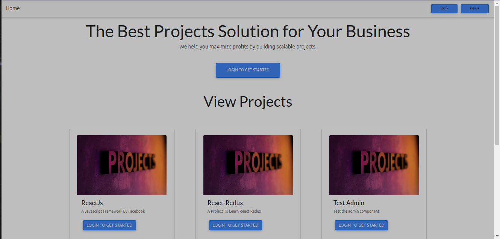

# Project-Management-System



A project management system created using:
- Node.js and Express for the backend using the Microservice Architecture.
- MS SQL server for the database.
- React.js for the frontend.

## Third Party Intergrations
### 1.Gmail
  - Send Email Upon Successful User Registration
  - Send System Usage Instructions Upon Successful Login
### 2.Africa's Talking
  - Send a welcome SMS Upon Successful User Registration
## Modules
### 1. Users
  - Bcrypt to hash password before storing it to the database and to decrypt it when signing in.
  - Json web tokens(JWT) for authorization ie, generate a token when a user signs in so that they can perform private functionalities like updating their profile
  and also for viewing private routes.
  - Users are assigned projects which also contain tasks.
### 2. Projects
  - A user can work on a single Project
  - A project has multiple tasks
  
### 3. Tasks
  - A tasks can belong to a single project
  - Users can be assigned multiple projects

### Database

Create a MS SQL server database and give it your preferred name and add three tables
  - Users
  - Projects
  - Tasks
  
## Microservices
### 1.User-Service
  - Handles all the user services.
  - An example is the user authentication.
### 2.Projects_Tasks-Service
  - Handles all the projects and tasks services.
  - An example is project assigning.
### 3.Background-Service
  - Handles all the background services cron jobs.
  - An example is the email and sms cron jobs that run every second watching for new users.

### Env Variables

Create a .env file in the root and add the following
```
DB_HOST= localhost
DB_USER= ms sql server username
DB_NAME= your database name
DB_PASSWORD= your sql server password
SECRET_KEY= your secret key

```

### Install Dependencies (root,client & servers)

```
# install concurrently in the root directory
npm install

cd Serverside/Userservice
npm install

cd Serverside/Projects_Task_Service
npm install

cd Serverside/BackgroundService
npm install

cd ClientSide/user-system
npm install
```

### Run

```
# Run client (:3000) & servers (:8000, :9000, :7000)
npm start server.js

